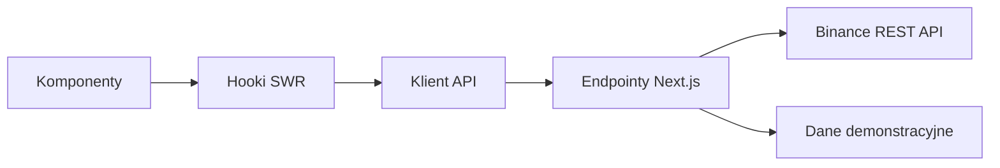

# Trading Dashboard

## O aplikacji

Panel do śledzenia Bitcoina, Ethereum, Solany i BNB. Pokazuje ceny, wykresy, listę obserwowanych aktywów i proste obliczenia na podstawie danych rynkowych. Ceny pochodzą z Binance Spot i odświeżają się co minutę. Aplikacja nie służy do składania zleceń.

[Otwórz aplikację](https://trading-dashboard-sandy-six.vercel.app/) · [Wyniki testów](https://github.com/beerck7/trading-dashboard/actions/workflows/ci.yml)

## Funkcje

- Aktualne ceny, zmiany dobowe, wolumen i małe wykresy trendu.
- Wykresy świecowe i obszarowe z zakresami 1H, 4H, 1D i 1W.
- Wyszukiwarka w tabeli rynków i lista obserwowanych zapisywana w przeglądarce.
- Obliczenia dynamiki zmian, zmienności i wolumenu dla wybranego aktywa.
- Stany ładowania, braku danych i błędu, ponowienie pobierania oraz czas ostatniej aktualizacji.
- Opcjonalny tryb demo bez połączenia z zewnętrznym API rynku.

## Technologie

| Narzędzie                            | Zastosowanie                                      |
| ------------------------------------ | ------------------------------------------------- |
| Next.js 16, React 19                 | Strony, komponenty i endpointy API                |
| TypeScript                           | Typowanie i sprawdzanie kodu przed uruchomieniem  |
| Tailwind CSS 4 i CSS komponentów     | Układ i wygląd interfejsu                         |
| SWR                                  | Pobieranie, pamięć podręczna i odświeżanie danych |
| Lightweight Charts                   | Wykresy cen i wolumenu                            |
| ESLint, testy Node, Playwright i axe | Sprawdzanie kodu, testy i kontrola dostępności    |

Skrypty uruchomienia i budowania korzystają z Webpack.

## Organizacja kodu

Komponenty wyświetlają dane i obsługują działania użytkownika. Hooki SWR pobierają dane przez wspólnego klienta API. Endpointy Next.js sprawdzają wybrane aktywo i zakres czasu, a następnie wywołują Binance lub funkcje trybu demo. Obliczenia znajdują się w `utils/analytics.ts`, dzięki czemu można je testować bez React.

Komponent wykresu tworzy go przy montowaniu, dopasowuje rozmiar do kontenera i usuwa przy odmontowaniu.

## Przepływ danych



Każde aktywo i zakres czasu mają osobny klucz SWR. Zmiana wyboru pobiera odpowiednie świece. Odpowiedzi są sprawdzane przed przekazaniem do wykresu, ponieważ samo typowanie TypeScript nie waliduje JSON z serwera. Jeśli odświeżenie się nie powiedzie, ostatnie poprawnie pobrane dane pozostają widoczne razem z ostrzeżeniem.

## Dane rynkowe i tryb demo

Domyślnie aplikacja pobiera rzeczywiste dane z [oficjalnego endpointu danych rynkowych Binance](https://github.com/binance/binance-spot-api-docs/blob/master/faqs/market_data_only.md). Nie jest potrzebny klucz API. Pary są wyceniane w **USDT**. Formatowanie z symbolem dolara ułatwia odczyt, ale nie przelicza USDT na USD.

Ustaw `DATA_MODE=demo` w `.env.local`, aby korzystać ze stałych, syntetycznych danych z 2 października 2026 r. Ten tryb przydaje się do pracy bez internetu i powtarzalnych testów. Interfejs pokazuje wybrany tryb. Nieudane pobranie rzeczywistych danych wyświetla błąd i nie przełącza automatycznie na demo.

Aplikacja udostępnia dwa endpointy:

```text
GET /api/markets
GET /api/candles?symbol=BTCUSDT&timeframe=1d
```

Obsługiwane symbole to `BTCUSDT`, `ETHUSDT`, `SOLUSDT` i `BNBUSDT`. Zakresy czasu to `1h`, `4h`, `1d` i `1w`. Niepoprawny wybór zwraca HTTP 400. Limit czasu żądania wynosi osiem sekund; błędy przejściowe powodują najwyżej dwie ponowne próby.

Karty analityczne korzystają z prostych obliczeń:

- Dynamika zmian (momentum): zmiana między pierwszą ceną otwarcia a ostatnią ceną zamknięcia.
- Zmienność: odchylenie standardowe kolejnych logarytmicznych stóp zwrotu. Karty dobowe używają świec 15-minutowych; wynik nie jest zmiennością w skali roku.
- Cena ważona wolumenem: typowa cena świecy `(high + low + close) / 3`, ważona wolumenem aktywa bazowego. To przybliżenie VWAP.

Wolumen na wykresie jest podany w jednostkach aktywa bazowego, a w tabeli rynków w walucie kwotowanej. Opisy zdarzeń dotyczą danych, a nie rekomendacji transakcji.

## Responsywność

Na mniejszych ekranach karty i panele układają się pionowo. Szerokie tabele przewijają się wewnątrz panelu, zachowując widoczną kolumnę aktywa. Nawigacja mobilna otwiera się przyciskiem menu i zamyka klawiszem Escape.

## Dostępność

- Podpisane kontrolki, widoczny fokus i link pozwalający przejść do treści.
- Tabela pełnej historii cen jako alternatywa dla wykresu na canvas.
- Tekst i znaki obok kolorów oznaczających zmiany cen.
- Obsługa preferencji ograniczonego ruchu.
- Lokalnie ładowany Inter; etykiety i tekst pomocniczy mają co najmniej 12 px. Wykresy używają tego samego fontu.

## Zrzuty ekranu


<details>
<summary>Panel na telefonie</summary>


</details>

Aby zaktualizować obrazy, uruchom aplikację i wykonaj `node scripts/screenshots.mjs`.

## Struktura projektu

```text
src/
  app/          # Strony, style, fonty i endpointy API
  components/   # Komponenty panelu, nawigacji i wykresów
  hooks/        # Hooki danych rynkowych i listy obserwowanych
  services/     # Żądania API, walidacja i dane demo
  constants/    # Aktywa, zakresy czasu i ustawienia odświeżania
  types/        # Typy danych rynkowych
  utils/        # Formatowanie i obliczenia
tests/          # Testy jednostkowe i przeglądarkowe
docs/           # Zrzuty ekranu i dokumentacja
```

## Uruchomienie lokalne

Wymagany jest Node.js 22 lub nowszy.

```bash
git clone https://github.com/beerck7/trading-dashboard.git
cd trading-dashboard
npm ci
npm run dev
```

Otwórz [localhost:3000](http://localhost:3000). Tryb rzeczywistych danych wymaga internetu. Baza danych i konto na giełdzie nie są potrzebne.

Zbudowanie i uruchomienie aplikacji:

```bash
npm run build
npm start
```

Sprawdzenie kodu i testy:

```bash
npm run lint
npm run typecheck
npm test
npm run build
npx playwright install chromium
npm run test:e2e
```

Testy przeglądarkowe uruchamiają serwer w trybie demo na porcie 3000. Najpierw zatrzymaj inne serwery używające tego portu. GitHub Actions wykonuje te same kontrole.

## Zmienne środowiskowe

| Zmienna     | Wartość domyślna | Opcje             |
| ----------- | ---------------- | ----------------- |
| `DATA_MODE` | `live`           | `live` lub `demo` |

Plik środowiskowy jest opcjonalny. Aby zmienić tryb, skopiuj `.env.example` do `.env.local`, zmień wartość i uruchom serwer ponownie. Żadne sekrety nie są wymagane.

## Publikacja

Aplikacja działa na Vercel. Przy imporcie repozytorium wybierz katalog główny `./` i framework Next.js. `vercel.json` określa komendy instalacji i budowania. Zmiany wysłane na `main` uruchamiają publikację.

## Pomysły na dalszy rozwój

- Eksport CSV i więcej aktywów na liście obserwowanych.
- Pamięć podręczna na serwerze ograniczająca liczbę żądań do giełdy.
- Testy w Firefox i Safari oraz ręczne sprawdzenie czytnikiem ekranu.

## Biblioteki i licencje

Wykresy korzystają z [TradingView Lightweight Charts](https://github.com/tradingview/lightweight-charts); oznaczenie autorstwa pozostaje w aplikacji. [Inter](https://github.com/rsms/inter) jest dołączony na licencji [SIL Open Font License](src/app/fonts/LICENSE.txt).
