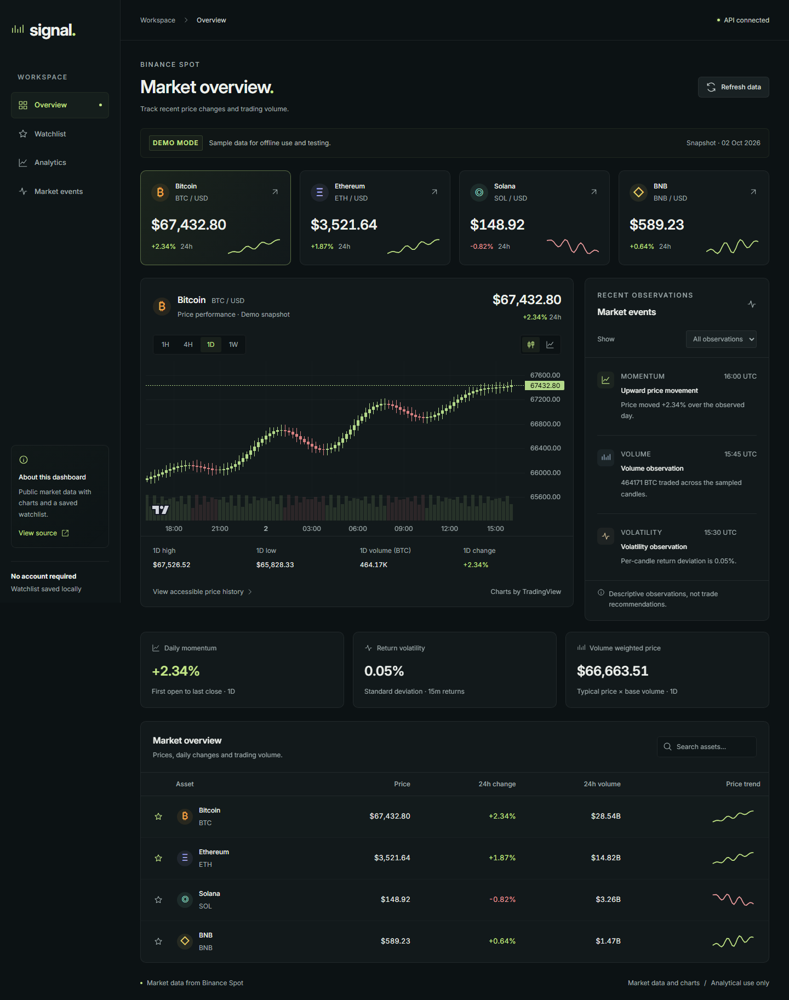
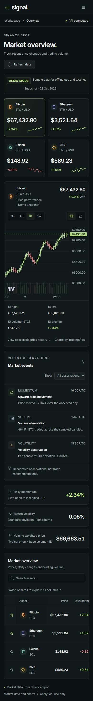

# Trading Dashboard

## O projekcie

Panel do śledzenia Bitcoina, Ethereum, Solany i BNB. Pokazuje ceny, wykresy, listę obserwowanych aktywów i podstawowe statystyki rynku. Dane pochodzą z publicznego API Binance Spot i odświeżają się co minutę. Aplikacja nie służy do składania zleceń.

[Otwórz aplikację](https://trading-dashboard-sandy-six.vercel.app/)

## Najważniejsze funkcje

- Aktualne ceny, zmiany dobowe, wolumen i małe wykresy trendu.
- Wykresy świecowe i obszarowe z zakresami 1H, 4H, 1D i 1W.
- Wyszukiwarka aktywów i lista obserwowanych zapisywana lokalnie.
- Obliczenia dynamiki zmian, zmienności i ceny ważonej wolumenem.
- Stany ładowania i błędu, ponowienie żądania oraz czas ostatniej aktualizacji.
- Tryb demo ze stałymi danymi do pracy bez internetu i testów.
- Tabela historii cen jako dostępna alternatywa dla wykresu.

## Technologie

Next.js 16, React 19, TypeScript, Tailwind CSS 4, SWR, Lightweight Charts i Binance REST API. Sprawdzanie kodu: ESLint, testy Node, Playwright i axe.

Komponenty korzystają z hooków SWR, a endpointy Next.js pobierają dane z Binance. Symbol i zakres czasu mają osobny klucz cache. Odpowiedzi API są walidowane przed przekazaniem do wykresu; przy nieudanym odświeżeniu ostatnie poprawne dane pozostają widoczne z ostrzeżeniem.

Dane Binance nie wymagają klucza API. Pary są wyceniane w USDT; symbol dolara przy cenie nie oznacza przeliczenia na USD. Statystyki opisują wybrany zbiór świec, bez rekomendacji transakcji. Wykresy korzystają z [TradingView Lightweight Charts](https://github.com/tradingview/lightweight-charts), a lokalny Inter zachowuje [licencję SIL OFL](src/app/fonts/LICENSE.txt).

## Uruchomienie

Wymagany Node.js 22+.

```sh
npm ci
npm run dev
```

Otwórz `http://localhost:3000`. Domyślnie działa pobieranie rzeczywistych danych, wymagające internetu. Aby włączyć demo, skopiuj `.env.example` do `.env.local`, ustaw `DATA_MODE=demo` i uruchom serwer ponownie. Błąd API nie przełącza aplikacji automatycznie na demo.

```sh
npm run lint
npm run typecheck
npm test
npm run build
```

Po buildzie uruchom aplikację przez `npm start`. Testy przeglądarkowe wymagają zbudowanej aplikacji i Chromium:

```sh
npx playwright install chromium
npm run test:e2e
```

Playwright uruchamia serwer w trybie demo na porcie 3000. Zatrzymaj wcześniej inne serwery na tym porcie. Testy sprawdzają m.in. zmianę aktywa i zakresu, listę obserwowanych, błędy API, responsywność i dostępność.

## Zrzuty ekranu



<details>
<summary>Panel na telefonie</summary>



</details>

## Co było celem projektu

Połączenie interaktywnego interfejsu React z rzeczywistymi danymi rynkowymi. Chciałem przećwiczyć obsługę pobierania i błędów, integrację wykresów oraz testowanie obliczeń niezależnie od komponentów.
